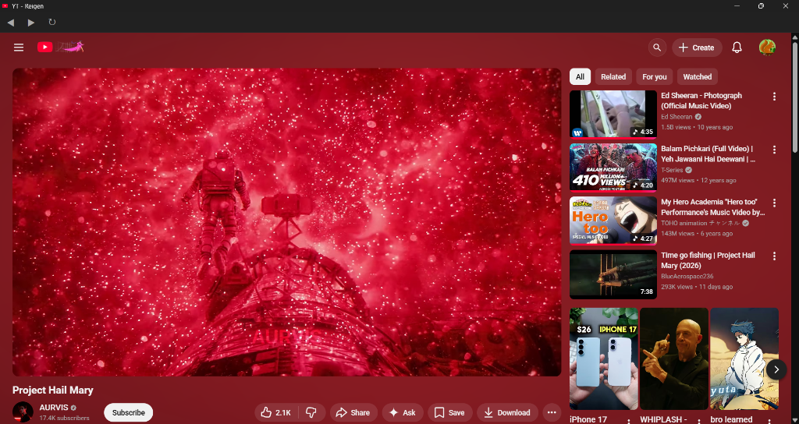

<p align="center">
  
</p>

<h1 align="center">YT – REIGEN</h1>

<p align="center">
  <strong>🎬 Cinematic Ambient Engine for YouTube</strong>
</p>

<p align="center">
  A minimalist Chrome extension that transforms YouTube into an immersive, theater-like experience with real-time ambient glow, transparent UI, and a distraction-free layout.
</p>

<p align="center">
  
  
  
  
</p>

<p align="center">
  <a href="https://github.com/SaishNehe05/YT--Reigen-Extension-/raw/main/YT%20-%20extension.crx">
    
  </a>
</p>

---

## 🖼️ Screenshots

### 🌌 Ambient Glow in Action

The glow engine samples colors from the video edges in real-time and projects them as smooth radial gradients across the entire page — creating an immersive, theater-like atmosphere.

<p align="center">
  
</p>
<p align="center"><em>🎵 DanDaDan OP — Teal / Green ambient glow matching the anime visuals</em></p>

<br/>

<p align="center">
  
</p>
<p align="center"><em>🚀 Project Hail Mary — Deep red glow radiating from the cinematic space scene</em></p>

<br/>

<p align="center">
  
</p>
<p align="center"><em>🎤 Olivia Rodrigo – drop dead — Purple / pink ambient glow matching the music video</em></p>

> **Notice how the entire page background, masthead, and sidebar become transparent** — the dynamic glow bleeds through everything, adapting to whatever you're watching.

---

## ✨ Features

| Feature | Description |
|---|---|
| **🌈 Ambient Glow Engine** | Samples video frame edges in real-time and projects dynamic radial color gradients behind the entire page |
| **🎥 Cinematic Transparent UI** | Makes the YouTube masthead, sidebar, comments, and player containers fully transparent so the glow shines through |
| **🔍 Minimalist Search** | Collapses the YouTube search bar into a single icon — press `S` to search, `Esc` to close |
| **⚡ GPU-Accelerated** | Uses offscreen canvas, `requestVideoFrameCallback`, compositor layer isolation, and delta-threshold skipping for buttery performance |
| **🎛️ Popup Control Panel** | Premium glassmorphism UI to toggle each feature independently |
| **💾 Persistent Settings** | All preferences saved via `chrome.storage.local` and synced in real-time |

---

## 🚀 Installation

### Option 1: Install via CRX File (Quick)

1. **Download** the extension file:
   
   [](https://github.com/SaishNehe05/YT--Reigen-Extension-/raw/main/YT%20-%20extension.crx)

2. **Open Chrome** and navigate to:
   ```
   chrome://extensions/
   ```

3. **Enable Developer Mode** (toggle in the top-right corner)

4. **Drag and drop** the `.crx` file onto the extensions page

5. **Navigate to YouTube** — the ambient glow activates automatically on any video page 🎬

### Option 2: Load Unpacked (Developer Mode)

1. **Clone this repository**
   ```bash
   git clone https://github.com/SaishNehe05/YT--Reigen-Extension-.git
   ```

2. **Open Chrome** → go to `chrome://extensions/` → **Enable Developer Mode**

3. Click **"Load unpacked"** and select the cloned project folder

4. **Navigate to YouTube** and enjoy the cinematic experience 🎬

---

## 🎮 Usage

| Action | How |
|---|---|
| Toggle Ambient Glow | Click the extension icon → flip the **Ambient Glow Engine** switch |
| Toggle Minimalist Search | Click the extension icon → flip the **Minimalist Search** switch |
| Open Search | Press **`S`** on any YouTube page (when not typing) |
| Close Search | Press **`Esc`** or click outside the masthead |
| Check Status | The popup footer shows **"Active on YouTube"** (green) or **"Open YouTube"** (gray) |

---

## 🏗️ Project Structure

```
YT-Reigen/
├── manifest.json          # Chrome Extension manifest (V3)
├── background.js          # Service worker — initializes default settings
├── content.js             # Core engine — ambient glow, search, layout
├── content.css            # Cinematic styles — transparency, glow canvas, search
├── popup.html             # Extension popup markup
├── popup.css              # Glassmorphism popup styles
├── popup.js               # Popup logic — toggle sync with chrome.storage
├── icon.png               # Extension icon
├── YT - extension.crx     # Packaged extension for quick install
├── .gitignore             # Excludes private key (.pem) from repo
├── screenshots/           # README screenshots
│   ├── ambient-teal.png
│   ├── ambient-red.png
│   └── ambient-purple.png
└── README.md
```


## 🛠️ Tech Stack

- **Chrome Extension Manifest V3**
- **Vanilla JavaScript** — no frameworks, no dependencies
- **Canvas 2D API** — offscreen sampling + fullscreen glow rendering
- **CSS Glassmorphism** — `backdrop-filter: blur()` for the popup panel
- **Google Fonts** — [Outfit](https://fonts.google.com/specimen/Outfit) for premium typography
- **`chrome.storage.local`** — real-time settings sync between popup and content script

---

## 📄 License

This project is open source and available under the [MIT License](LICENSE).
