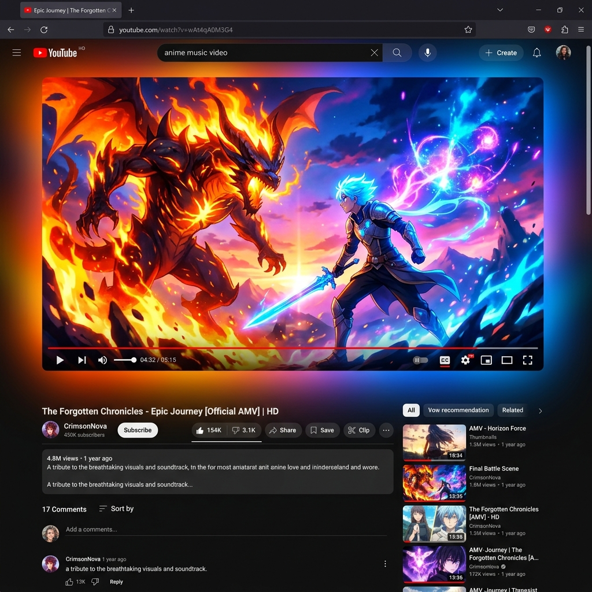
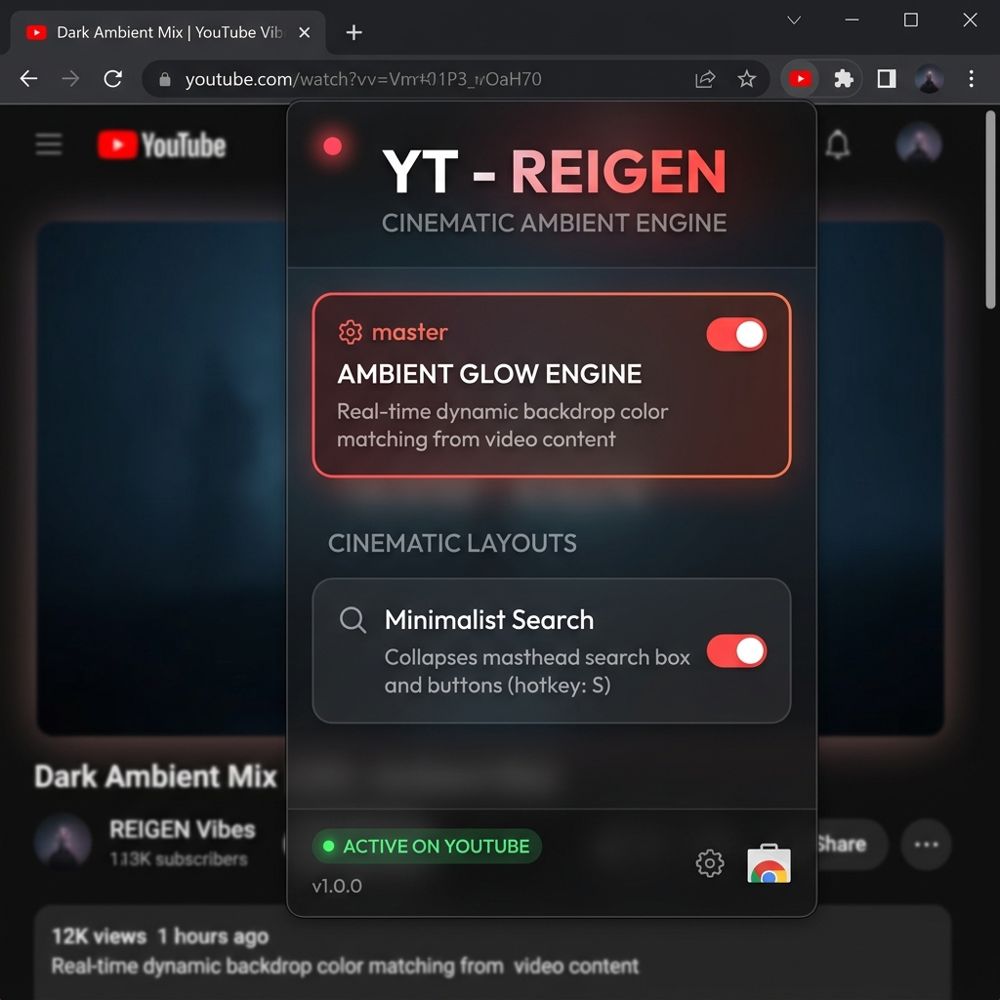
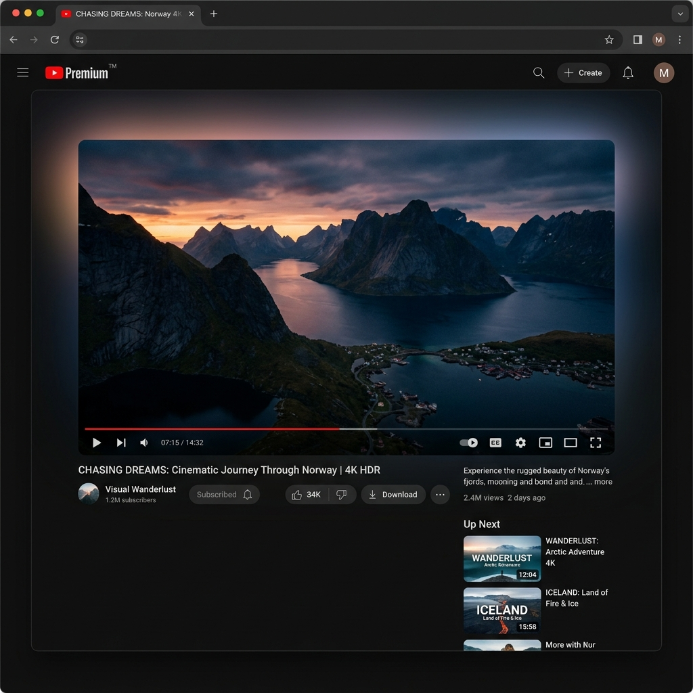

<p align="center">
  
</p>

<h1 align="center">YT – REIGEN</h1>

<p align="center">
  <strong>🎬 Cinematic Ambient Engine for YouTube</strong>
</p>

<p align="center">
  A minimalist Chrome extension that transforms YouTube into an immersive, theater-like experience with real-time ambient glow, transparent UI, and a distraction-free layout.
</p>

<p align="center">
  
  
  
  
</p>

---

## 🖼️ Screenshots

### 🌌 Ambient Glow in Action

<p align="center">
  
</p>

> The ambient glow engine samples colors from the video in real-time and projects them as smooth radial gradients across the entire page background — creating an immersive, theater-like atmosphere.

---

### 🎛️ Control Panel

<p align="center">
  
</p>

> A premium glassmorphism popup panel lets you toggle features on/off. The status badge shows whether the extension is active on the current YouTube tab.

---

### 🔍 Minimalist Search

<p align="center">
  
</p>

> The default YouTube search bar is hidden and replaced with a compact search icon. Press **`S`** to expand it instantly, or **`Esc`** to dismiss.

---

## ✨ Features

| Feature | Description |
|---|---|
| **🌈 Ambient Glow Engine** | Samples video frame edges in real-time and projects dynamic radial color gradients behind the entire page |
| **🎥 Cinematic Transparent UI** | Makes the YouTube masthead, sidebar, comments, and player containers fully transparent so the glow shines through |
| **🔍 Minimalist Search** | Collapses the YouTube search bar into a single icon — press `S` to search, `Esc` to close |
| **⚡ GPU-Accelerated** | Uses offscreen canvas, `requestVideoFrameCallback`, compositor layer isolation, and delta-threshold skipping for buttery performance |
| **🎛️ Popup Control Panel** | Premium glassmorphism UI to toggle each feature independently |
| **💾 Persistent Settings** | All preferences saved via `chrome.storage.local` and synced in real-time |

---

## 🚀 Installation

### Load as Unpacked Extension (Developer Mode)

1. **Clone this repository**
   ```bash
   git clone https://github.com/SaishNehe05/YT--Reigen-Extension-.git
   ```

2. **Open Chrome** and navigate to:
   ```
   chrome://extensions/
   ```

3. **Enable Developer Mode** (toggle in the top-right corner)

4. Click **"Load unpacked"** and select the cloned project folder

5. **Navigate to YouTube** — the ambient glow activates automatically on any video page 🎬

---

## 🎮 Usage

| Action | How |
|---|---|
| Toggle Ambient Glow | Click the extension icon → flip the **Ambient Glow Engine** switch |
| Toggle Minimalist Search | Click the extension icon → flip the **Minimalist Search** switch |
| Open Search | Press **`S`** on any YouTube page (when not typing) |
| Close Search | Press **`Esc`** or click outside the masthead |
| Check Status | The popup footer shows **"Active on YouTube"** (green) or **"Open YouTube"** (gray) |

---

## 🏗️ Project Structure

```
YT-Reigen/
├── manifest.json          # Chrome Extension manifest (V3)
├── background.js          # Service worker — initializes default settings
├── content.js             # Core engine — ambient glow, search, layout
├── content.css            # Cinematic styles — transparency, glow canvas, search
├── popup.html             # Extension popup markup
├── popup.css              # Glassmorphism popup styles
├── popup.js               # Popup logic — toggle sync with chrome.storage
├── icon.png               # Extension icon
├── screenshots/           # README screenshots
│   ├── ambient-glow.png
│   ├── popup-panel.png
│   └── minimalist-search.png
└── README.md
```

---

## ⚙️ How the Ambient Glow Works

```
┌─────────────────────────────────────────────────────────┐
│  VIDEO FRAME                                            │
│  ┌──────┬──────────────────────────────────┬──────┐     │
│  │ LEFT │            TOP EDGE              │RIGHT │     │
│  │ EDGE │                                  │ EDGE │     │
│  │      │                                  │      │     │
│  │      │        Video Content             │      │     │
│  │      │                                  │      │     │
│  │      │          BOTTOM EDGE             │      │     │
│  └──────┴──────────────────────────────────┴──────┘     │
└─────────────────────────────────────────────────────────┘
                          ↓
         ┌────────────────────────────────┐
         │   64×36 offscreen canvas       │
         │   Sample 4 edge regions        │
         │   EMA color smoothing (0.5)    │
         └────────────────────────────────┘
                          ↓
         ┌────────────────────────────────┐
         │   160×90 fullscreen glow       │
         │   4 radial gradients drawn     │
         │   GPU-composited layer         │
         │   Delta-threshold skip (<2)    │
         └────────────────────────────────┘
                          ↓
              🎬 Cinematic Ambient Glow
```

**Key optimizations:**
- **`requestVideoFrameCallback`** — syncs sampling to actual video frame updates, not arbitrary timers
- **Motion energy check** — skips processing entirely when the video frame hasn't changed
- **Delta-threshold rendering** — skips canvas writes when color change is imperceptible (Δ < 2)
- **`desynchronized: true`** — bypasses double-buffering for lower latency
- **`will-change: transform`** + **`contain: strict`** — isolates the glow canvas on its own compositor layer

---

## 🛠️ Tech Stack

- **Chrome Extension Manifest V3**
- **Vanilla JavaScript** — no frameworks, no dependencies
- **Canvas 2D API** — offscreen sampling + fullscreen glow rendering
- **CSS Glassmorphism** — `backdrop-filter: blur()` for the popup panel
- **Google Fonts** — [Outfit](https://fonts.google.com/specimen/Outfit) for premium typography
- **`chrome.storage.local`** — real-time settings sync between popup and content script

---

## 📄 License

This project is open source and available under the [MIT License](LICENSE).

---

<p align="center">
  Made with ❤️ by <a href="https://github.com/SaishNehe05">SaishNehe05</a>
</p>
